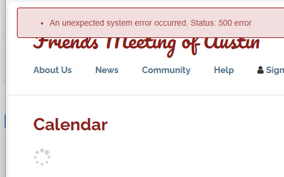
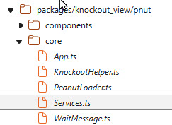
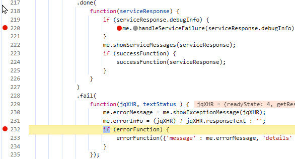
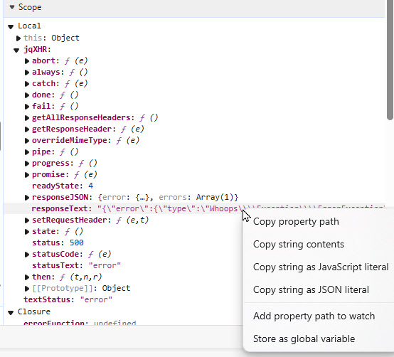

# Debugging with browser developer tools

Suppose you get a mysterious error message like this one. Perhaps it only occurs
in deployment.  



Here's how to find where problems occur in a call to one of our ServiceCommand classes:

(note: ServiceCommand will be explained in a future doc.)

Press F12 to open developer tools. These examples are in Edge but Chrome is 
very similar.

Click the "Sources" tab.


Browse the sources tree to find Services.ts or Services.js.



In the source pane, find ServiceBroker.executeRPC

Set breakpoints in the .done and .fail functions. This will usually be on 
lines 220 and 232:



Refresh and one of these two breakpoints should be hit.  If this occurs in the 
.fail function, go to the right pane and look under the scope section and select

Local > jXHR >  responseText or  

Closure > me:ServiceBroker > errorInfo

You may be able to read the error infomation right there but it is often
more convenient to copy and paste in a text editor.



Here you'll find detailed information about the error, which may show
the way to resolution in your development environment:

Example:

````
{"error":{"type":"Whoops\\Exception\\ErrorException",
"message":"Array and string offset access syntax with curly braces is no longer supported",
"code":64,
"file":"\/home4\/austinqu\/public_html\/staging.root\/packages\/knockout_view\/src\/tops\/sys\/TDateRepeater.php",
"line":180,
"trace":[...
````
The .fail function will execute if there is a low level exception such as when a syntax
error causes the php file not to execute, or a spelling error in a class name prevents
the class from loading.

The .done function executes when a service call successfully executes.  However
if the service catches an exception, the information you need is returned in
serviceResponse.debugInfo.  You can retrieve this text in a similar way to what you
did in the .fail function.
