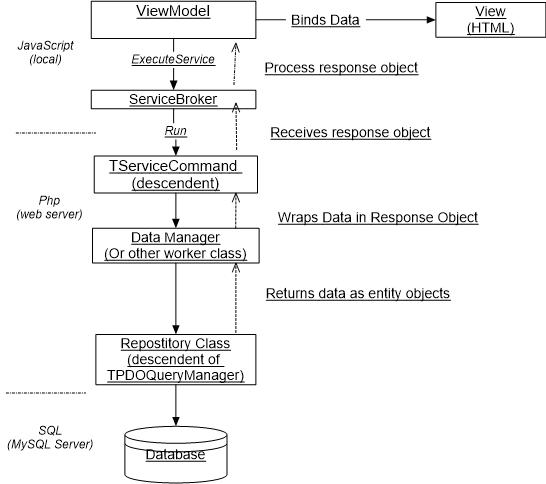

# Peanut Patterns
## ViewModel > ServiceCommand > Repository

The "ViewModel > ServiceCommand > Repository" (as I am calling it) is the
foundation pattern in Peanut for fetching data from the SQL database and displaying
it on the web page. And, additionally, process business rules and other tasks 
along the way.

This scenario is repeated numerous times across the application.

The main actors in this scenario are these classes and their descendents:
1) ViewModel (Typescript)
2) TServiceCommand (PHP)
3) TPdoQueryManager (PHP) 

Other classes my play supporting roles include entity classes (TPDOQueryManager and descendants), 
Data manager classes (suffixed with "DataManager") ServiceBroker (JavaScript) and others.

This may seem complicated at first due to the number of objects involved.  
However, the strict seperation of concerns means that most classes have a 
relatively small amount of code to perform a clearly defined task.



Lets walk through this scenario with a specific example. 

### ViewModel

The example starts in pnut/packages/mailboxes/vm/MailboxesViewModel.ts, 
the ViewModel in our diagram. See pnut/packages/mailboxes/js/MailboxListObservable.ts
The MailboxListObservable is a helper class that we'll consider a part of this View Model.

The 'downloadMailboxList' function (line 45) quite obviously is supposed to get a 
list of mailbox object and display them on the webpage.  On line 59 we call a 'Service Command':
````typescript
me.services.executeService('peanut.Mailboxes::GetMailboxList',request,
    function(serviceResponse: Peanut.IServiceResponse) {
        if (translated) {
            me.application.hideWaiter();
        }
        if (serviceResponse.Result == Peanut.serviceResultSuccess) {
            let response = <IGetMailboxesResponse>serviceResponse.Value;
            me.owner.addTranslations(response.translations);
            me.setMailboxes(response.list)
        }
````
The initial parameter of "executeService" tells us the name an location of the service command
By convention this will be TGetMailboxListCommand.  For new, we'll skip explaining the connecting
that makes an AJAX service call to the web server and how the framework identifies the 
TServiceCommand subclass and executes its "run()" method.

The request object is empty in this case but if the service needs input it would contain
the input values.

### Service Command and a "datamanager"

The GetMailboxListCommand receives the request and fires the run() method, 
pnut/packages/mailboxes/src/services/GetMailboxListCommand.php, line 70.

On line 83 of GetMailboxListCommand we retrieve the list from a "data manager" class, TPostOffice,
and insert the result in a response object;
````php
    protected function run()
    {
    ...
        $manager = TPostOffice::GetMailboxManager();
        $response = new \stdClass();
        $response->list = $manager->getMailboxes(true);
    ...        
    }
````

### A "repository"
The TPostOffice class creates a repository class, MailboxesRepository.  The MailboxesRepository->getMailboxList() 
method calls on its parent class to execute a statement.
````php
$stmt = $this->executeStatement($sql);
````
 Then returns an array of mailbox objects.
````php
    $stmt->setFetchMode(PDO::FETCH_OBJ);
    $result = $stmt->fetchAll();
````
These methods rely on the PHP PDO framework ([PHP Data Objects](https://www.php.net/manual/en/book.pdo.php)) to execute a query on the database and 
format the result as an array of objects.

### ViewModel and View
The response object is returned to MailboxListObservable, on line 63 where it 
is bound to the view
````typescript
    if (serviceResponse.Result == Peanut.serviceResultSuccess) {
        let response = <IGetMailboxesResponse>serviceResponse.Value;
        me.owner.addTranslations(response.translations);
        me.setMailboxes(response.list)
    }
````
Note that the structure of the response is specified in an Interface that conforms
to the structure of the pHP object returned from the service command.
````typescript
    export interface IGetMailboxesResponse {
        list: IMailBox[];
        translations: string[];
    }
````
This is solely for the convenience of the programmer and error checking.

This completes the scenario depicted in our diagram.


